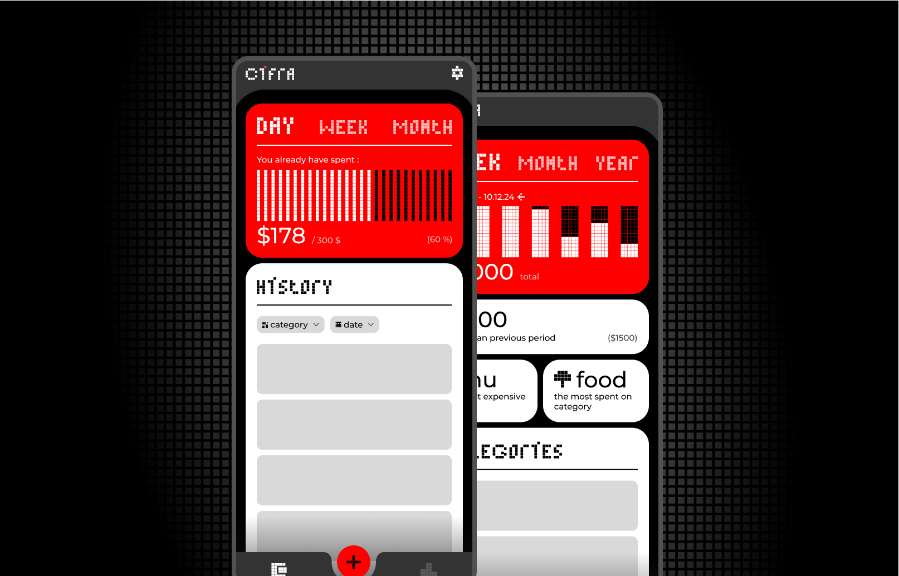

# **C1fra** | Start saving today

**Cifra** is a **finance tracking mobile application** currently **under development** using **Flutter**. Its aim is to provide users with a minimalist, engaging, and efficient way to monitor their spending habits and stay on top of their financial goals. The app leverages modern UI design principles and simple yet effective features for personal finance management.
# Key features
- **Budget Monitoring**
- **Categorized Expenses 
- **Spending History**
- **Visual Data Analytics**
- **Modern UI**
